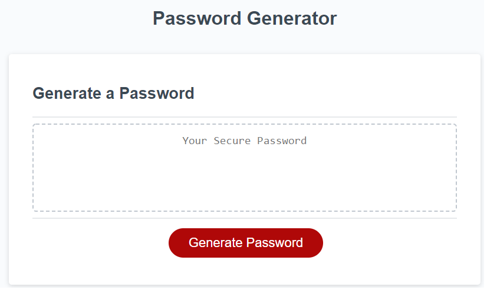

#The Password Generator (https://rafialmadrid.github.io/passwordGenerator/) <-- Link to the deployed app

This app allows the user to generate a secure password with the specific types of characters  the user wants to use.

When the user pushes the button "Generate Password", an alert will request the length of the password. The response has to be numeric and from 8 to 128 characters long, otherwise, it would request the value again and again.

Once having a correct length, the user will be able to select lower cases, upper cases, numbers and special characters.

The app will show the user the result in the screen. If refreshed, the process can be repeated.
